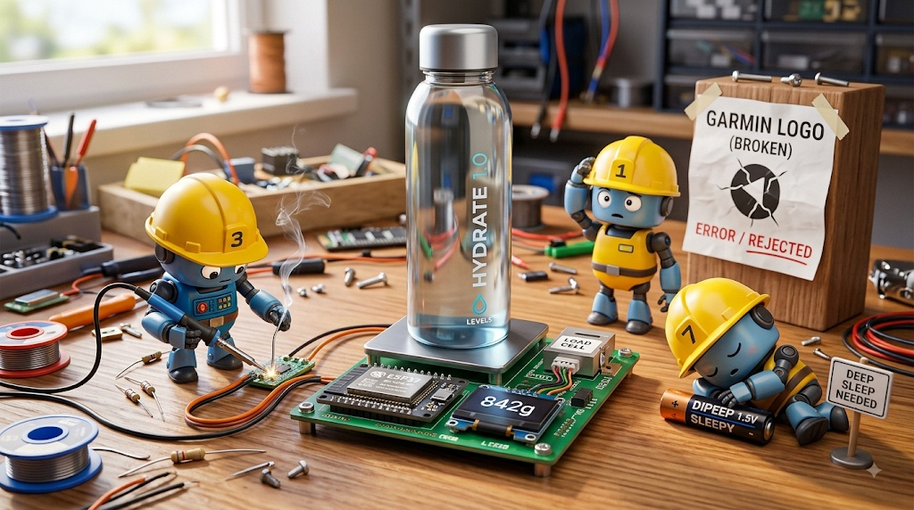
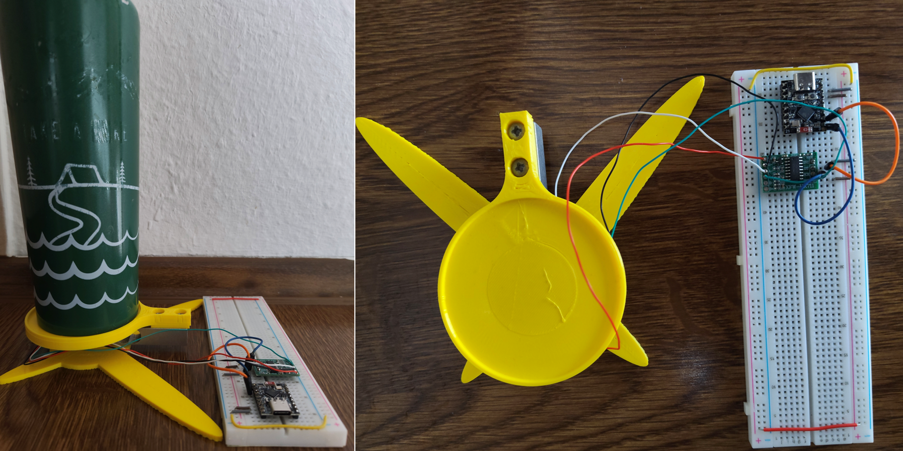

# 🚧 AquaTrack



ESP32-C3 based water bottle scale. HX711 + 5kg load cell, event-driven processing, deep-sleep concept for battery operation (not yet implemented).

## Status

Done and tested: `WaterTracker`, `ScaleManager`, `EventDispatcher`. 8 native tests, all passing.

Stub, compiles, no functionality: `GarminUploader`, `ESPHttpClient`.

Not implemented: `DataLogger`, `InterruptHandler`, `CommandProcessor`. Header/empty .cpp, no logic.

RTC: NTP sync over WiFi. No external RTC hardware. Drifts without a WiFi connection.

Garmin upload: no public REST API for end users. Web-scraping approach blocked by captcha. Currently manual entry in the Garmin app only.

## Hardware

ESP32-C3 SuperMini, HX711, 5kg load cell. Pinout/datasheet in `docs/hardware/`.



3D-printable housing (STL files): `docs/cad/`.

## Architecture

Event dispatcher pattern (observer). `WaterTracker` doesn't know its consumers. `main.cpp`, future display/upload modules listen for events (`ContainerRefilled`, `ContainerEmpty`, `ConsumedMl`, `ErrorWaterTracker`, ...).

Sensor interface (`IScaleSensor`) decouples hardware from logic. Enables mocking for native tests without a board.

## Build & Test

```sh
# Native unit tests, no board required
pio test -e native_test_env

# Firmware for ESP32-C3
pio run -e esp32-c3-devkitm-1

# Hardware test (HX711 sensor, board connected via USB)
pio test -e hardware_test_env
```

Adjust COM port in `platformio.ini` under `[common]`.

## Remaining Work

- No deep sleep, no interrupt handling for battery operation. `InterruptHandler` is empty.

- No persistence layer. Values are lost on reboot, `WaterTracker::begin()` currently loads nothing.
   
- `updateConsumption()` assumes monotonically decreasing weight between two readings. No handling for mid drink or half refills.

- No HMI or display.

- No config commands. `CommandProcessor` unfinished, see comments in `lib/    CommandProcessor`.

- RTC time isn't set anywhere yet. `RTCManager::setTime()` exists but nothing calls it from `main.cpp`.

## License

MIT